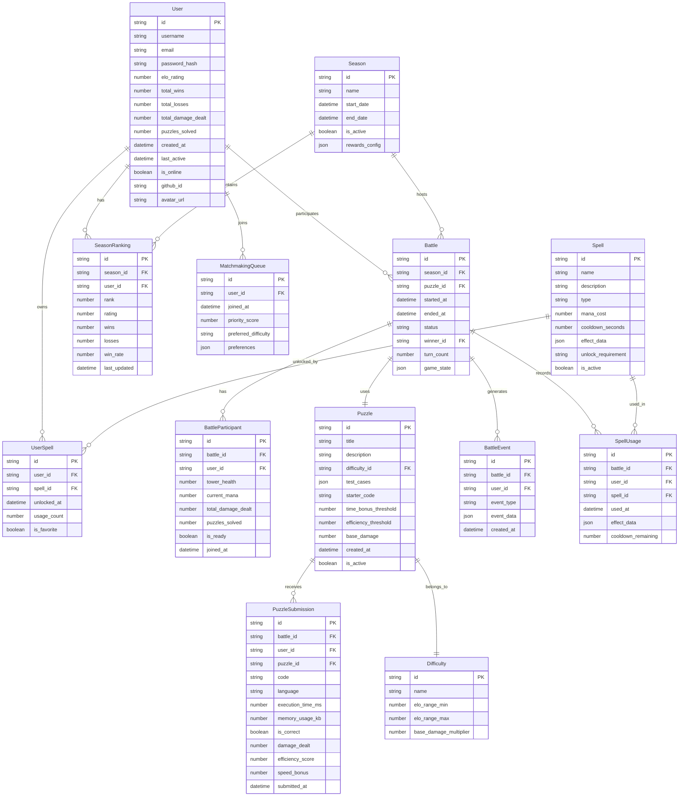

# Code-Clash: Arena of Algorithms - Technical Architecture

## Project Overview
Real-time 1v1 competitive coding game where players solve logic puzzles to deal damage to opponents' towers.

## Tech Stack
- **Frontend**: React 18 + TypeScript + Tailwind CSS + Zustand + Monaco Editor
- **Backend**: Node.js + Express + Socket.io + Redis + MongoDB
- **Code Execution**: Judge0 self-hosted/CE API
- **Auth**: JWT + bcrypt + optional GitHub OAuth

---

## Monorepo Folder Structure

```
code-clash/
├── packages/
│   ├── frontend/                    # React web client
│   │   ├── public/
│   │   ├── src/
│   │   │   ├── components/          # Reusable UI components
│   │   │   │   ├── ui/             # Basic UI primitives
│   │   │   │   ├── game/           # Game-specific components
│   │   │   │   └── layout/         # Layout components
│   │   │   ├── pages/              # Page components
│   │   │   ├── hooks/              # Custom React hooks
│   │   │   ├── stores/             # Zustand stores
│   │   │   ├── services/           # API and WebSocket services
│   │   │   ├── utils/              # Utility functions
│   │   │   ├── types/              # TypeScript type definitions
│   │   │   └── styles/             # Global styles and Tailwind config
│   │   ├── package.json
│   │   └── tsconfig.json
│   │
│   ├── backend/                     # Node.js API server
│   │   ├── src/
│   │   │   ├── controllers/        # Route controllers
│   │   │   ├── services/           # Business logic services
│   │   │   │   ├── matchmaking/    # Matchmaking logic
│   │   │   │   ├── battle/         # Battle room management
│   │   │   │   ├── judge/          # Judge0 integration
│   │   │   │   ├── auth/           # Authentication service
│   │   │   │   └── leaderboard/    # Ranking service
│   │   │   ├── models/             # MongoDB models
│   │   │   ├── middleware/         # Express middleware
│   │   │   ├── routes/             # API routes
│   │   │   ├── socket/             # Socket.io handlers
│   │   │   ├── utils/              # Utility functions
│   │   │   ├── types/              # TypeScript types
│   │   │   └── config/             # Configuration files
│   │   ├── tests/                  # Unit and integration tests
│   │   ├── package.json
│   │   └── tsconfig.json
│   │
│   ├── shared/                      # Shared types and utilities
│   │   ├── src/
│   │   │   ├── types/              # Common TypeScript types
│   │   │   ├── constants/          # Shared constants
│   │   │   ├── utils/              # Shared utilities
│   │   │   └── schemas/            # Validation schemas
│   │   ├── package.json
│   │   └── tsconfig.json
│   │
│   └── game-engine/                 # Core game logic (could be separate service)
│       ├── src/
│       │   ├── damage/             # Damage calculation engine
│       │   ├── spells/             # Spell system
│       │   ├── puzzles/            # Puzzle management
│       │   ├── matchmaking/        # ELO and pairing algorithms
│       │   └── state/              # Game state management
│       ├── package.json
│       └── tsconfig.json
│
├── docker/                          # Docker configurations
│   ├── frontend.Dockerfile
│   ├── backend.Dockerfile
│   ├── redis.Dockerfile
│   ├── mongodb.Dockerfile
│   └── judge0.Dockerfile
│
├── k8s/                            # Kubernetes manifests (optional)
│   ├── frontend/
│   ├── backend/
│   ├── redis/
│   ├── mongodb/
│   └── judge0/
│
├── scripts/                        # Development and deployment scripts
│   ├── dev.sh                      # Local development setup
│   ├── build.sh                    # Build all packages
│   ├── deploy.sh                   # Deployment script
│   └── seed-data.js                # Database seeding
│
├── docs/                           # Documentation
│   ├── api/                        # API documentation
│   ├── game-rules/                 # Game rules and mechanics
│   └── deployment/                 # Deployment guides
│
├── .github/                        # GitHub Actions
│   └── workflows/
│       ├── ci.yml
│       └── deploy.yml
│
├── docker-compose.yml              # Local development
├── docker-compose.prod.yml         # Production setup
├── package.json                    # Root package.json
├── lerna.json                      # Monorepo configuration
├── tsconfig.json                   # Root TypeScript config
└── README.md                       # Project README
```

---

## Entity Relationship Diagram

### Core Entities



---

## WebSocket Event Schema

### Client → Server Events

#### Authentication & Connection
```typescript
// Authenticate connection
socket.emit('authenticate', {
  token: string;
  userId: string;
});

// Join matchmaking queue
socket.emit('join_queue', {
  preferences: {
    difficulty?: 'easy' | 'medium' | 'hard';
    timeLimit?: number;
    languages?: string[];
  };
});

// Leave matchmaking queue
socket.emit('leave_queue');

// Ready for battle
socket.emit('battle_ready', {
  battleId: string;
});

// Submit code solution
socket.emit('submit_solution', {
  battleId: string;
  puzzleId: string;
  code: string;
  language: string;
});

// Use spell
socket.emit('use_spell', {
  battleId: string;
  spellId: string;
  targetUserId?: string; // for targeted spells
});

// Send battle chat message
socket.emit('battle_chat', {
  battleId: string;
  message: string;
});

// Surrender battle
socket.emit('surrender', {
  battleId: string;
});
```

#### Battle Actions
```typescript
// Request hint
socket.emit('request_hint', {
  battleId: string;
  puzzleId: string;
});

// Skip puzzle
socket.emit('skip_puzzle', {
  battleId: string;
  puzzleId: string;
});

// Ping for connection health
socket.emit('ping');
```

### Server → Client Events

#### Connection & Queue
```typescript
// Authentication result
socket.emit('auth_result', {
  success: boolean;
  user?: UserProfile;
  error?: string;
});

// Matchmaking status
socket.emit('queue_status', {
  status: 'searching' | 'found' | 'cancelled';
  queueSize?: number;
  estimatedWaitTime?: number;
});

// Match found
socket.emit('match_found', {
  battle: BattleInfo;
  opponent: UserProfile;
  puzzle: PuzzleInfo;
});
```

#### Battle Events
```typescript
// Battle state update
socket.emit('battle_update', {
  battleId: string;
  gameState: GameState;
  participants: BattleParticipant[];
  currentTurn: string;
  timeRemaining: number;
});

// Code submission result
socket.emit('submission_result', {
  battleId: string;
  submissionId: string;
  success: boolean;
  damage: number;
  efficiency: number;
  speedBonus: number;
  executionTime: number;
  error?: string;
  testResults: TestCaseResult[];
});

// Opponent submission (for display)
socket.emit('opponent_submission', {
  battleId: string;
  userId: string;
  success: boolean;
  damage: number;
  timeTaken: number;
});

// Spell cast notification
socket.emit('spell_cast', {
  battleId: string;
  casterId: string;
  spellId: string;
  effect: SpellEffect;
  targetUserId?: string;
});

// Spell cooldown update
socket.emit('spell_cooldown', {
  battleId: string;
  spellId: string;
  cooldownRemaining: number;
});

// Tower damage update
socket.emit('tower_damage', {
  battleId: string;
  userId: string;
  damage: number;
  remainingHealth: number;
  damageSource: 'puzzle' | 'spell';
});

// Battle ended
socket.emit('battle_ended', {
  battleId: string;
  winner: string;
  loser: string;
  finalStats: BattleStats;
  ratingChange: RatingChange;
  rewards: BattleRewards;
});

// Hint provided
socket.emit('hint_provided', {
  battleId: string;
  puzzleId: string;
  hint: string;
  manaCost: number;
});

// Battle chat message
socket.emit('battle_chat_message', {
  battleId: string;
  senderId: string;
  senderName: string;
  message: string;
  timestamp: string;
});

// Error events
socket.emit('error', {
  code: string;
  message: string;
  context?: any;
});
```

#### Real-time Updates
```typescript
// Leaderboard update
socket.emit('leaderboard_update', {
  season: string;
  rankings: LeaderboardEntry[];
  userRank?: number;
});

// User status updates
socket.emit('user_status', {
  userId: string;
  status: 'online' | 'offline' | 'in_battle';
  currentBattleId?: string;
});

// Connection health check
socket.emit('pong');
```

---

## Damage Calculation Formula

### Base Damage Formula
```typescript
interface DamageCalculation {
  baseDamage: number;           // From puzzle difficulty
  speedBonus: number;           // Time-based bonus
  efficiencyBonus: number;     // Code quality bonus
  spellMultiplier: number;      // Active spell effects
  finalDamage: number;
}

function calculateDamage(submission: PuzzleSubmission, context: BattleContext): DamageCalculation {
  const { puzzle, executionTime, memoryUsage, isCorrect } = submission;
  const { activeSpells, comboMultiplier } = context;
  
  // 1. Base damage from puzzle difficulty
  let baseDamage = puzzle.baseDamage;
  
  // 2. Speed bonus (faster = more damage)
  const speedThreshold = puzzle.timeBonusThreshold; // e.g., 30 seconds
  const speedBonus = Math.max(0, (speedThreshold - executionTime) / speedThreshold) * 50;
  
  // 3. Efficiency bonus (less memory/time = more damage)
  const efficiencyScore = calculateEfficiency(submission, puzzle);
  const efficiencyBonus = efficiencyScore * 30;
  
  // 4. Spell multipliers
  const spellMultiplier = activeSpells.reduce((product, spell) => product * spell.damageMultiplier, 1);
  
  // 5. Combo multiplier (consecutive correct submissions)
  const comboBonus = comboMultiplier > 1 ? (comboMultiplier - 1) * 10 : 0;
  
  // Final calculation
  const finalDamage = Math.round(
    (baseDamage + speedBonus + efficiencyBonus + comboBonus) * spellMultiplier
  );
  
  return {
    baseDamage,
    speedBonus,
    efficiencyBonus,
    spellMultiplier,
    finalDamage
  };
}
```

### Efficiency Score Calculation
```typescript
function calculateEfficiency(submission: PuzzleSubmission, puzzle: Puzzle): number {
  // Time efficiency (0-1 scale)
  const timeEfficiency = Math.min(1, puzzle.efficiencyThreshold / submission.executionTime);
  
  // Memory efficiency (0-1 scale)
  const memoryEfficiency = Math.min(1, puzzle.memoryThreshold / submission.memoryUsage);
  
  // Code quality (0-1 scale) - based on cyclomatic complexity, lines of code, etc.
  const codeQuality = calculateCodeQuality(submission.code);
  
  // Weighted average
  return (timeEfficiency * 0.4 + memoryEfficiency * 0.3 + codeQuality * 0.3);
}
```

### Spell Damage Effects
```typescript
interface SpellEffect {
  type: 'damage_boost' | 'damage_reduction' | 'mana_drain' | 'tower_heal';
  value: number;
  duration: number;
  target: 'self' | 'opponent' | 'both';
}

// Example spell effects:
const SPELL_EFFECTS = {
  DOUBLE_DAMAGE: { damageMultiplier: 2.0, duration: 30000 },
  SHIELD: { damageReduction: 0.5, duration: 15000 },
  MANA_DRAIN: { manaDrain: 20, instant: true },
  HEAL: { towerHeal: 25, instant: true }
};
```

---

## Complete API Endpoint List

### REST API Endpoints

#### Authentication
```
POST   /api/auth/register
POST   /api/auth/login
POST   /api/auth/logout
POST   /api/auth/refresh
GET    /api/auth/me
POST   /api/auth/github
GET    /api/auth/github/callback
```

#### Users
```
GET    /api/users/profile
PUT    /api/users/profile
GET    /api/users/:userId
GET    /api/users/:userId/stats
PUT    /api/users/preferences
POST   /api/users/avatar
```

#### Puzzles
```
GET    /api/puzzles
GET    /api/puzzles/:puzzleId
GET    /api/puzzles/difficulty/:difficulty
POST   /api/puzzles (admin)
PUT    /api/puzzles/:puzzleId (admin)
DELETE /api/puzzles/:puzzleId (admin)
```

#### Battles
```
GET    /api/battles/:battleId
GET    /api/battles/history
GET    /api/battles/active
POST   /api/battles/replay/:battleId
```

#### Spells
```
GET    /api/spells
GET    /api/spells/:spellId
POST   /api/spells/:spellId/unlock
GET    /api/users/spells
POST   /api/users/spells/:spellId/favorite
```

#### Leaderboard
```
GET    /api/leaderboard/global
GET    /api/leaderboard/season/:seasonId
GET    /api/leaderboard/friends
GET    /api/leaderboard/user/:userId
```

#### Seasons
```
GET    /api/seasons/current
GET    /api/seasons/:seasonId
GET    /api/seasons/history
```

#### Matchmaking
```
POST   /api/matchmaking/join
DELETE /api/matchmaking/leave
GET    /api/matchmaking/status
```

#### Admin
```
GET    /api/admin/stats
GET    /api/admin/users
POST   /api/admin/users/:userId/ban
GET    /api/admin/battles
POST   /api/admin/seasons
PUT    /api/admin/config
```

### WebSocket Events Summary

#### Connection Management
- `authenticate` ↔ `auth_result`
- `ping` ↔ `pong`

#### Matchmaking
- `join_queue` ↔ `queue_status`, `match_found`
- `leave_queue` ↔ `queue_status`

#### Battle Gameplay
- `battle_ready` ↔ `battle_update`
- `submit_solution` ↔ `submission_result`, `opponent_submission`
- `use_spell` ↔ `spell_cast`, `spell_cooldown`
- `request_hint` ↔ `hint_provided`
- `surrender` ↔ `battle_ended`

#### Real-time Updates
- `tower_damage` (broadcast)
- `battle_chat` ↔ `battle_chat_message`
- `leaderboard_update` (broadcast)
- `user_status` (broadcast)

#### Error Handling
- `error` (server → client for all error types)

---

## Technical Architecture Overview

### Service Architecture
1. **API Gateway** - Nginx/Express for routing and load balancing
2. **Game Server** - Node.js + Socket.io for real-time battles
3. **Matchmaking Service** - Dedicated service for ELO-based pairing
4. **Judge Service** - Judge0 integration for code execution
5. **Session Store** - Redis for real-time state and pub/sub
6. **Database** - MongoDB for persistent data
7. **Leaderboard Service** - Redis sorted sets for rankings

### Scalability Considerations
- **Horizontal Scaling**: Multiple game server instances behind load balancer
- **Database Sharding**: MongoDB sharding by user ID or battle ID
- **Redis Clustering**: For session storage and leaderboards
- **Judge0 Scaling**: Multiple judge instances with queue management
- **CDN**: For static assets and puzzle content

### Performance Optimizations
- **Connection Pooling**: Database and Redis connection pools
- **Caching**: Redis caching for user profiles and puzzle data
- **Lazy Loading**: Load battle history and stats on demand
- **Compression**: WebSocket message compression
- **Rate Limiting**: API and submission rate limiting

### Security Measures
- **JWT Authentication**: Secure token-based auth
- **Input Validation**: Comprehensive input sanitization
- **Code Sandboxing**: Judge0 isolated execution environments
- **Rate Limiting**: Prevent abuse and DoS attacks
- **CORS**: Proper cross-origin resource sharing
- **HTTPS**: Encrypted communication

This architecture provides a solid foundation for a scalable, real-time competitive coding game with all the requested features.
